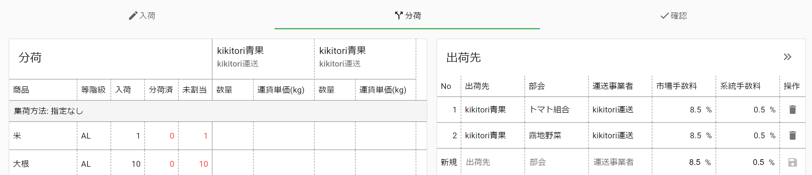
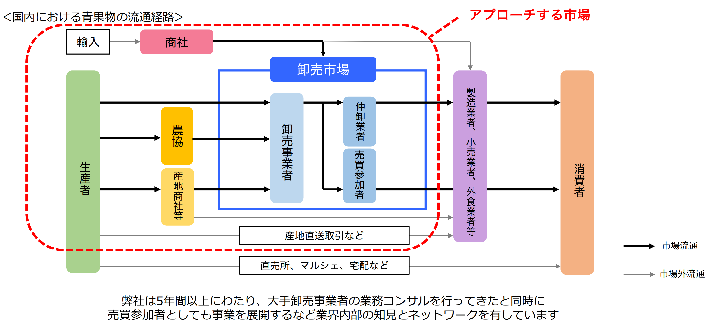

# React の Ref とフォーカス管理におけるベストプラクティス

株式会社 kikitori CTO

永谷 龍彦

[リポジトリ](https://github.com/chelproc/20210715-coral-react-lt)

[サンプル](samples)

---

## 自己紹介

<!-- block-start: grid -->
<!-- block-start: column -->


<!-- block-end -->
<!-- block-start: column -->

東京大学工学部システム創生学科環境・エネルギーシステム専攻。

10 歳からプログラミングをスタート。14 歳で学内向け学習 Q&A サービスを開発。2018 年よりフリーランスとして活動を開始。フロントからバックエンドまで多様な言語を扱うフルスタックエンジニア。

2019 年に株式会社 kikitori に参画。

<!-- block-end -->
<!-- block-end -->

---

## Ref とは

> Ref は render メソッドで作成された DOM ノードもしくは React の要素にアクセスする方法を提供します。
>
> -- https://ja.reactjs.org/docs/refs-and-the-dom.html

---

## 基本的な使い方

`useRef` の戻り値を `ref` 属性に渡すと `current` フィールドに DOM オブジェクトが入る。[サンプル](samples/sample01)

```tsx
export default function Sample1() {
  const ref = useRef<HTMLInputElement>(null);

  return (
    <>
      <input ref={ref} />
      <button
        onClick={() => {
          ref.current?.focus();
        }}
      >
        focus
      </button>
    </>
  );
}
```

---

## Ref の歴史

- ~~String Refs~~ (たぶん初期からある)
- Callback Ref (v0.13.0 / 2015 年)
  - String Refs より柔軟に Ref が扱えるようになった。
- Ref オブジェクト (v16.3.0 / 2018 年)
  - Callback Ref よりも開発者にとって使いやすいインターフェースを目指して開発された。

---

## Class Component 時代の Ref (1)

Class Component 時代の Ref: クラスコンポーネントのインスタンスを取得するための仕組み。[サンプル](samples/sample02)

```tsx
class Child extends Component {
  render() {
    return <div>Hello World</div>;
  }
}

export default class Sample02 extends Component {
  divRef = createRef<HTMLDivElement>();
  divElement: HTMLDivElement | null = null;
  childRef = createRef<Child>();

  render() {
    return (
      <>
        {/* Ref オブジェクトを使う場合 */}
        <div ref={this.divRef} />
        {/* Callback Ref を使う場合 */}
        <div
          ref={(element) => {
            this.divElement = element;
          }}
        />
        <Child ref={this.childRef} />
      </>
    );
  }
}
```

対象が DOM 要素であれば DOM オブジェクトが、カスタムコンポーネントであればそのインスタンスが取得できる

---

## Class Component 時代の Ref (2)

子コンポーネントのメソッドが呼び出せたりする。[サンプル](samples/sample03)

```tsx
class Child extends Component<{}, { count: number }> {
  state = { count: 1 };

  increment() {
    this.setState((state) => ({ count: state.count + 1 }));
  }

  render() {
    return <div>{this.state.count}</div>;
  }
}

export default class Sample03 extends Component {
  ref = createRef<Child>();

  render() {
    return (
      <>
        <Child ref={this.ref} />
        <button
          onClick={() => {
            this.ref.current?.increment();
          }}
        >
          increment
        </button>
      </>
    );
  }
}
```

---

## Hooks 以降の Ref (1)

インスタンスが存在しないため、Ref を取得できない。[サンプル](samples/sample04)

```tsx
function Child() {
  return <div>Child</div>;
}

export default function Sample04() {
  const ref = useRef<any>(null);

  // @ts-expect-error Property 'ref' does not exist on type 'IntrinsicAttributes'.
  return <Child ref={ref} />;
}
```

---

## Hooks 以降の Ref (2)

`forwardRef` を使うと function component でも ref を公開できる。[サンプル](samples/sample05)

```tsx
const Child = forwardRef<HTMLInputElement>(function Child(_, ref) {
  return <input ref={ref} />;
});

export default function Sample05() {
  const ref = useRef<HTMLInputElement>(null);

  return (
    <>
      <Child ref={ref} />
      <button
        onClick={() => {
          ref.current?.focus();
        }}
      >
        focus
      </button>
    </>
  );
}
```

---

## Hooks 以降の Ref (3)

`ref` という属性名にこだわらなければ別に `forwardRef` を使う必要はない。[サンプル](samples/sample06)

```tsx
function Child(props: { innerRef: Ref<HTMLInputElement> }) {
  return <input ref={props.innerRef} />;
}

export default function Sample06() {
  const ref = useRef<HTMLInputElement>(null);

  return (
    <>
      <Child innerRef={ref} />
      <button
        onClick={() => {
          ref.current?.click();
        }}
      />
    </>
  );
}
```

HoC を作る時やライブラリ作成者が Class Component → Functional Component に移行する際に便利。

---

## Hooks 以降の Ref (4)

`useImperativeHandle`を用いることで自由な値を ref に設定できる。以下の例では、単純な関数を Ref として使用している。[サンプル](samples/sample07)

```tsx
type ChildRef = () => void;

const Child = forwardRef<ChildRef>(function Child(_, ref) {
  const inputRef = useRef<HTMLInputElement>(null);

  useImperativeHandle(ref, () => () => {
    inputRef.current?.focus();
  });

  return <input ref={inputRef} />;
});

export default function Sample07() {
  const ref = useRef<ChildRef>(null);

  return (
    <>
      <Child ref={ref} />
      <button
        onClick={() => {
          ref.current?.();
        }}
      >
        focus
      </button>
    </>
  );
}
```

---

## useEffect を用いた useImperativeHandle の再実装

[サンプル](samples/sample08)

```tsx
useEffect(() => {
  const refValue = () => {
    inputRef.current?.focus();
  };

  // Callback Refの場合
  if (typeof ref === "function") {
    ref(refValue);
    return () => {
      ref(null);
    };
  }

  // Ref オブジェクトの場合
  if (ref) {
    ref.current = refValue;
    return () => {
      ref.current = null;
    };
  }
});
```

（少なくとも）コンポーネントのマウント時とアンマウント時に親から渡された Ref の値を設定すればよい。

`useImperativeHandle`を使うことで、Ref オブジェクトと Callback Ref の差異を吸収できる。

---

## Hooks 後の Ref のユースケース

- DOM にアクセスする ← 今まで扱ってきた
- **Class Component のインスタンス変数の代わり**
  - ミュータブル
  - 変更しても再レンダリングされない

---

## Ref の DOM 以外のユースケース (1)

[react-use](https://github.com/streamich/react-use)の[useMountedState](https://github.com/streamich/react-use/blob/master/src/useMountedState.ts)

```tsx
export default function useMountedState(): () => boolean {
  const mountedRef = useRef<boolean>(false);
  const get = useCallback(() => mountedRef.current, []);

  useEffect(() => {
    mountedRef.current = true;

    return () => {
      mountedRef.current = false;
    };
  }, []);

  return get;
}
```

コンポーネントが破棄された後もアクセスする可能性があるため、Ref オブジェクトの中にマウント状態を格納している

---

## Ref の DOM 以外のユースケース (2)

[react-redux](https://github.com/reduxjs/react-redux)の[useSelector](https://github.com/reduxjs/react-redux/blob/master/src/hooks/useSelector.js)

```tsx
function useSelectorWithStoreAndSubscription(selector, equalityFn, store) {
  const latestSelector = useRef();
  const latestStoreState = useRef();
  const latestSelectedState = useRef();

  let selectedState;
  if (
    selector !== latestSelector.current ||
    storeState !== latestStoreState.current
  ) {
    const newSelectedState = selector(storeState);
    if (!equalityFn(newSelectedState, latestSelectedState.current))
      selectedState = newSelectedState;
    else selectedState = latestSelectedState.current;
  } else {
    selectedState = latestSelectedState.current;
  }
  return selectedState;
}
```

無用な再レンダリングを発生させないように、`selector` の結果を Ref に保存しておく。

---

## 突然ですが弊社の紹介です

<!-- block-start: grid -->
<!-- block-start: column -->


<!-- block-end -->
<!-- block-start: column -->

弊社 [kikitori](https://kikitori.jp/) は、農産物の流通現場向け SaaS「[nimaru](https://nimaru.jp/)」を通して、農業流通全体の DX に取り組んでいます。

全国の卸売市場や JA にてご利用いただいています。

<!-- block-end -->
<!-- block-end -->

---

## 業務システム開発にて

弊社のプロダクトの 1 つである nimaru JA は業務システム的な側面が強い



「Enter キーでカーソル移動したい」という要望が来たら？？

---

## 課題

Ref で複数の DOM をどう扱うか :thinking_face:

---

なんか Ref をゴニョゴニョするライブラリがあったような


---

## React Hook Form

`register` の戻り値には `Ref` が含まれる。

敢えて `value` 属性を使わず `input` を非制御のままにしておくことで、パフォーマンスを改善した。[サンプル](samples/sample09)

```tsx
type FormValue = {
  name: string;
};

export default function Sample09() {
  const { register, handleSubmit } = useForm<FormValue>();

  return (
    <form
      onSubmit={handleSubmit((e) => {
        alert(e.name);
      })}
    >
      <input {...register("name")} />
      <input type="submit" />
    </form>
  );
}
```

ちなみに v6 では `ref={register()}` とやっていたので v7 の API では背徳感が薄くなった（？）

---

## React Hook Form の動作原理

- `register` は `{ onChange(), ref }` の形のオブジェクトを返す
  - 使う側はスプレッド構文で展開するだけで使える
- `ref` は Callback Ref
- Callback Ref 内で**連想配列**の Ref オブジェクトに ref を保存する

```tsx
function useForm() {
  const ref = useRef<Record<string, HTMLInputElement>>({});
  const register = (name: string) => ({
    onChange() {},
    ref(element: HTMLInputElement | null) {
      ref.current[name] = element;
    },
  });
  return { register };
}
```

この仕組みは使えそうだ！！

---

## フォーカス管理の Hook の方針

- `useRef` の中で `Map<number, HTMLInputElement>` を管理する
- Hook の戻り値は `register` 関数で、フォーカスの順番を引数に指定すると `{ onKeyDown(), ref }` なオブジェクトを返す
- 使う側はスプレッド構文で展開するだけ

---

## 結果

[サンプル](samples/sample10)

```tsx
function useEnterKeyFocusControl() {
  const ref = useRef(new Map<number, HTMLInputElement>());
  return (index: number) => ({
    onKeyDown({ key }: { key: string }) {
      if (key !== "Enter") return;
      const sortedIndices = [...ref.current.keys()].sort();
      const nextIndex = sortedIndices[sortedIndices.indexOf(index) + 1];
      if (typeof nextIndex === "number") ref.current.get(nextIndex)?.focus();
    },
    ref(element: HTMLInputElement | null) {
      if (element) ref.current.set(index, element);
      else ref.current.delete(index);
    },
  });
}
```

---

## こんなに簡単に書けるようになりました

```tsx
export default function Sample10() {
  const register = useEnterKeyFocusControl();
  return (
    <>
      {[...Array(10).keys()].map((i) => (
        <input key={i} {...register(i)} />
      ))}
    </>
  );
}
```

---

## まとめ

- Hooks 時代の Ref の用途
  - DOM へのアクセス
  - ミュータブルな値を、レンダリングから独立して管理する
- useRef で得られるのは Ref オブジェクトだが、Callback Ref を組み合わせて使うとより柔軟に制御できる
- 「Callback Ref を生成する関数」を返す Custom Hook を作ると複数要素の Ref を高い抽象度で扱える

---

## 再び宣伝

<!-- block-start: grid -->
<!-- block-start: column -->

弊社 [kikitori](https://kikitori.jp/)は、国内農業流通の **8 割** を占める **市場流通** の DX に取り組んでいます。

私たちと日本の農業を未来をつくるプロダクトを開発しませんか？



<!-- block-end -->
<!-- block-start: column -->

<div class="left">

#### 技術スタック

##### フロントエンド

- TypeScript
- React
- Apollo
- Material-UI

##### バックエンド

- NestJS
- Apollo

##### インフラ

- ECS
- Aurora PostgreSQL
- Firebase Hosting
- AWS CDK (IaC)

</div>

<!-- block-end -->
<!-- block-end -->

---

ありがとうございました :bow:
